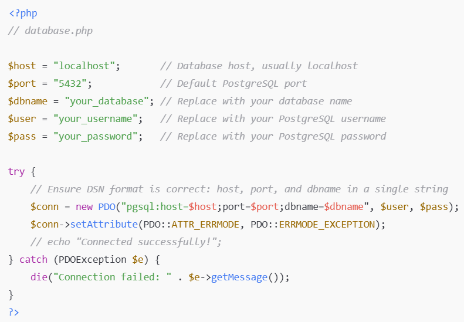

# CSFFilm Review Website 

CSFFilmReview is a web-based platform designed to make it easier for users to rate and review movies they have watched. The platform provides multiple movie genres, allowing users to give ratings and write reviews for various films. The goal is to help users quickly find information about movies and make informed decisions about which films to watch based on other users’ reviews.

CSFFilmReview is a web-based platform that enables users to perform full CRUD operations on movies and reviews. From an IT perspective:

1. Create: Users can add new reviews and ratings for movies they have watched. The system allows users to input their personal opinions, rate the movie, and submit it to the platform.

2. Read: Users can browse and read reviews written by others. They can search for movies by title, genre, or popularity, and view aggregated ratings and individual comments.

3. Update: Users can edit their existing reviews and update their ratings. This ensures that users can modify their opinions over time.

4. Delete: Users can remove their reviews if they no longer want them to appear on the platform.

These CRUD operations make the website interactive and user-centered, allowing users to manage their contributions while exploring feedback from others. From a technical perspective, the platform likely uses a database (SQL) to store movies, users, ratings, and reviews, while the front-end and back-end communicate through HTTP requests.

## Technologies Used
- **Frontend:** HTML, CSS, and JavaScript  
- **Backend:** PHP  
- **Database:** PostgreSQL  
- **Additional Libraries/Frameworks:** Bootstrap 5, Font Awesome  

## Main Features
- User registration and login  
- Forgot password functionality with verification  
- CRUD for movie reviews (Create, Read, Update, Delete)  
- Star rating system with average rating display  
- Movie genres and filtering  
- Description about Film Description

## Installation
1. To install and run CSFFilmReview locally, first clone the repository to your computer using VSCode or a terminal.
2. Open VSCode and open the terminal (shortcut Ctrl + ~ on Windows), then run the command git clone https://github.com/susanjong/CSFFilmReview.git. This will copy the entire project from GitHub to your local machine.
3. After cloning, you can choose the folder location where you want the project to be saved. If you want, you can also rename the folder to any name of your choice for easier management.
4. Next, open the folder in VSCode using File > Open Folder and make sure you have a local server environment installed such as PostgreSQL, extension in VSCode (PHP Server, PHP intelephense, etc).
5. Create a database.php file in every folder that needs database connection and paste this code:

Replace the placeholders your_database, your_username, and your_password with your actual PostgreSQL credentials. Any PHP file that needs database access can simply use include 'database.php';
7. Database Setup 
Follow these steps: 
- Locate the database_backup.zip file in the project folder.
- Extract the .zip file to get the .sql or .backup file.
- Open pgAdmin and connect to your PostgreSQL server.
- Create a new database (e.g., csffilmreview).
- Right-click the new database → choose Restore.
- Select the extracted backup file and click Restore.
- Once the restore process completes, the database is ready, and your application should now connect successfully.
7. If you want to run this website project, press the PHP Server logo on the top right side in Visual Studio Code.
8. Finish

## how to use this website 
1. Go to the main page, register or log in
2. Select a movie from the list or by genre
3. Add a review and star rating
4. View the latest reviews and average movie rating

Or you can open this youtube link for your guide ()

## Team Members
Group 7
1. Susan Jong (231401014)
2. Clarissa Halim (231401020)
3. Ferarine (231401095)
4. Fathurrahman Nasution (231401110)

Class: KOM B (2023)

Program: Computer Science
Faculty: Faculty of Computer Science and Information Technology
University: Universitas Sumatera Utara

